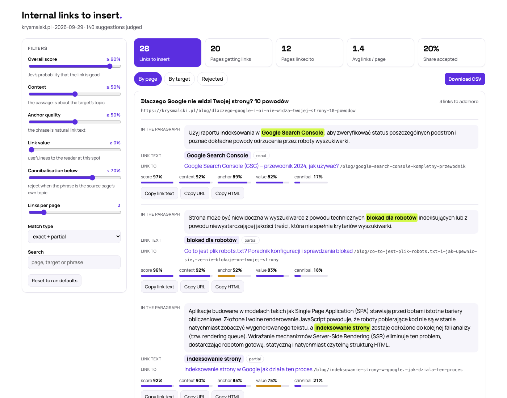

# internal-linking

Internal link suggestions for any website, in one command. The tool finds phrases that **already exist** in your content (exact or partial match of another page's name) and asks [Jev](https://openrouter.ai/) - a typed-decision model by TypeSafe, available through OpenRouter - to judge every page → phrase → target pair. The output is a CMS-agnostic HTML report and CSV with links ready to insert.

> Works with Polish and English pages. The language is detected per page (`<html lang>`, or the text when the attribute is missing), so bilingual sites get links within each language version. Other languages are skipped.



Full example: [`examples/report-krysmalski.pl.html`](examples/report-krysmalski.pl.html) - a real run on a 43-page SEO blog: 28 links on 20 pages, 140 suggestions judged, $0.01. Download it and open it in a browser.

## Why?

- **Links on text that is already there.** Most internal linking tools suggest "related pages" and leave it to you to find a spot, or write new sentences for you. This one only proposes a link where a matching phrase already exists, so you get the paragraph, the phrase and the target - nothing to rewrite.
- **Judged, not guessed.** Jev answers closed questions with probabilities (is the passage on topic, is the phrase a natural anchor, would the link cannibalise the source page), so decisions come from thresholds you can measure and tune instead of from reading generated prose.
- **Cheap enough for every site.** One Jev call per pair, cached between runs - a 50-page site costs about a cent.
- **Safe defaults.** No links from headings, no duplicates of existing links, no phrases repeated like a template, same language only, at most 3 new links per page.

The default thresholds were calibrated on Polish service and blog sites; on a new kind of site (e.g. an online store) or on English pages, check a sample first (see [Thresholds and quality checks](#thresholds-and-quality-checks-optional)).

## Install

```bash
git clone https://github.com/krysmalskipl/internal-linking && cd internal-linking
python3 -m venv .venv && .venv/bin/pip install -e .
cp .env.example .env   # put your OpenRouter API key in .env
```

On Windows (PowerShell):

```powershell
git clone https://github.com/krysmalskipl/internal-linking; cd internal-linking
py -m venv .venv; .venv\Scripts\Activate.ps1; pip install -e .
copy .env.example .env   # put your OpenRouter API key in .env
```

Open a report with `open data/example.com/report.html` (macOS) or `start data\example.com\report.html` (Windows).

## Usage

```bash
internal-linking run --domain example.com
internal-linking run --domain a.com --domain b.com       # several domains
internal-linking run --domains-file domains.txt          # one domain per line
internal-linking run --domain example.com --dry-run      # count pairs and estimate cost, no Jev calls
internal-linking run --domain example.com --no-crawl     # reuse downloaded pages
internal-linking run --domain example.com --max-links 5  # new links per page (default 3)
internal-linking run --domain shop.com --targets '/category/|/blog/'   # large shop: link only to categories and posts
internal-linking run --domain shop.com --sources '^/blog/'              # only blog posts get new links (to any page)
internal-linking run --domain example.com --sources-file urls.txt        # only these pages get new links (URLs or paths, one per line)
internal-linking run --domain example.com --sources '^/blog/' --keywords services.csv   # blog → service pages on your phrases
internal-linking run --domain example.com --keywords keywords.csv   # keyword mode, see below
internal-linking report --domain example.com             # rebuild report.html from saved results - no crawl, no Jev calls
internal-linking questions --lang en                     # print the questions sent to Jev (en / pl)
```

(With the virtualenv not activated, use `.venv/bin/internal-linking`.)

Results land in `data/<domain>/` (change with `--data-dir`):
- `report.html` - an interactive, self-contained report: every link as *where* (the paragraph with the highlighted phrase), *what* (the link text) and *where to* (the target), with copy buttons for the text, the URL and ready HTML; sliders in % for every Jev score, links per page, match type and search change the selection live; views: *Linking to* (the new links each page will get), *Linked from* (where each target's new links come from, with its links today - orphans and weakly linked pages flagged), *Pages* (every page with links today, new links in and out, sortable by the weakest linked), *Keywords* and *Rejected* (with reasons); collapsible groups; light / dark switch; CSV export of the current selection
- `links.csv` - links to insert
- `recommendations.csv` - every judged suggestion with its decision and reason

Jev answers are cached (`jev_pairs.jsonl`), so re-runs only pay for new or changed pairs. Rough numbers: a 50-page site takes about a minute and about $0.01; downloading is the slow part on large sites (about 0.5 s per page), the phrase search takes seconds thanks to a word index. `--sources` / `--targets` (regexes on the URL path) and `--sources-file` / `--targets-file` (lists of URLs or paths) choose which pages get links and which pages links may point to - the whole site is still crawled, so e.g. blog posts can link to service pages. On a shop with thousands of products they also keep the number of Jev calls - and the cost - under control; check it first with `--dry-run`.

## Keyword mode

By default the tool works out targets on its own: every page's title, H1 and slug are its keywords. With `--keywords` it links **only the phrases you list** - a keyword → URL map like the ones used in SEO audits:

```csv
keyword,target_url,match
bathroom renovation,https://example.com/bathroom-renovation/,exact
kitchen renovation,,partial
```

- `target_url` is optional - without it the target is the page whose title, H1 or slug matches the keyword best (marked "auto" in the report)
- `match`: `exact` (the whole keyword, inflection-aware) or `partial` (at least 2 of its words; default); one-word keywords are allowed here
- a plain text file with one keyword per line works too
- the same safety rules and the Jev check apply; each keyword is linked at most once per page, with no site-wide limit
- `keywords_summary.csv` and the table at the top of the report show, per keyword, where it was found, how many links it got and why the rest were rejected

## How it works

1. **Crawl** (`crawl.py`) - respects robots.txt (`Disallow`, `Crawl-delay`), reads the sitemap (from `robots.txt` or common locations) and, for each page, the title, H1, meta description, language, typed content blocks (paragraph, list item, heading...) and existing links (in content, breadcrumbs, elsewhere). Skips redirects, `noindex` and pages canonicalised elsewhere. Template blocks - text repeated verbatim across pages of the same language (top bars, sidebars, "areas we cover" sections, author bios) - are then removed from the content, so any theme works without configuration.
2. **Phrases** (`anchors.py`) - searches paragraphs and list items (never headings) for phrases matching another page's title, H1 or slug, inflection-aware, with per-language lists of function words and title fillers:
   - `exact` - the phrase covers the target's full name,
   - `partial` - at least two words of the target's name, including a distinctive one,
   - existing link text and code are never used; no single words or generic fillers.
3. **Rules** (`pipeline.py`) - no targets the page already links to (template links - menu, footer, sidebars, counted per language version - don't count), no target whose title or H1 is shared by several pages (e.g. the brand name as H1), same language only, no phrases repeated like a template (e.g. an author byline), a phrase that is the exact name of another page is reserved for that page.
4. **Jev** (`jev/pairs.py`) - one call per pair, with the source page, the section heading, the passage and its neighbouring passages, and the target page; closed questions: does the paragraph discuss the target's topic, is the phrase a natural anchor, link value (0-4), cannibalisation, overall verdict with a reason code. Inspired by the Jev mode in [newsjack](https://github.com/elvisun/newsjack). Print the questions with `internal-linking questions`.
5. **Selection** - thresholds from `config.json` (shared by all domains), one link per phrase, at most N links per page by score.

## Thresholds and quality checks (optional)

The default thresholds (`src/internal_linking/config.json`) were set on hand-labelled samples. A `config.json` in the working directory, or `--config`, overrides them. To check or retune them on your own sites:

```bash
internal-linking sample --domain example.com      # random sample of suggestions
internal-linking label --domain example.com       # label Yes / No in the browser (localhost:8765)
internal-linking evaluate --domain example.com --write-config   # signal AUC and new thresholds → ./config.json
```

## Project layout

```
src/internal_linking/
├── cli.py            # `internal-linking` command
├── pipeline.py       # candidates (automatic and keyword mode), rules, selection
├── keywords.py       # keyword list loading, target auto-pick
├── crawl.py          # sitemap, robots.txt, content blocks, existing links
├── anchors.py        # exact / partial phrase matching, language detection
├── report.py         # interactive report.html, `report` command
├── config.py         # thresholds (config.json)
├── jev/client.py     # OpenRouter decisions API
├── jev/pairs.py      # questions per pair, answer → columns, hard rules
└── quality/          # sample, label, evaluate
tests/                # pytest, no network: pip install -e ".[dev]" && pytest
```

## Notes

- The API client is `jev/client.py` (model `typesafe/jev-1.13`; `JEV_MODEL` / `JEV_API_URL` override the defaults). Jev is served from OpenRouter's alpha decisions endpoint, which may change.
- The crawler identifies itself as `internal-linking`, respects robots.txt and waits 0.5 s between requests by default (`--delay`). Only run it on sites you own or have permission to analyse.

## License

MIT
